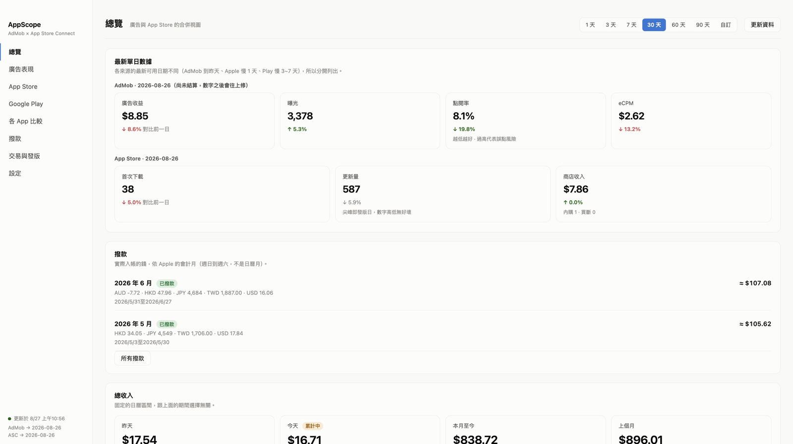
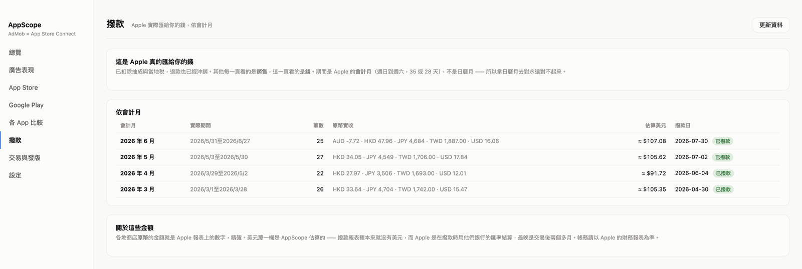
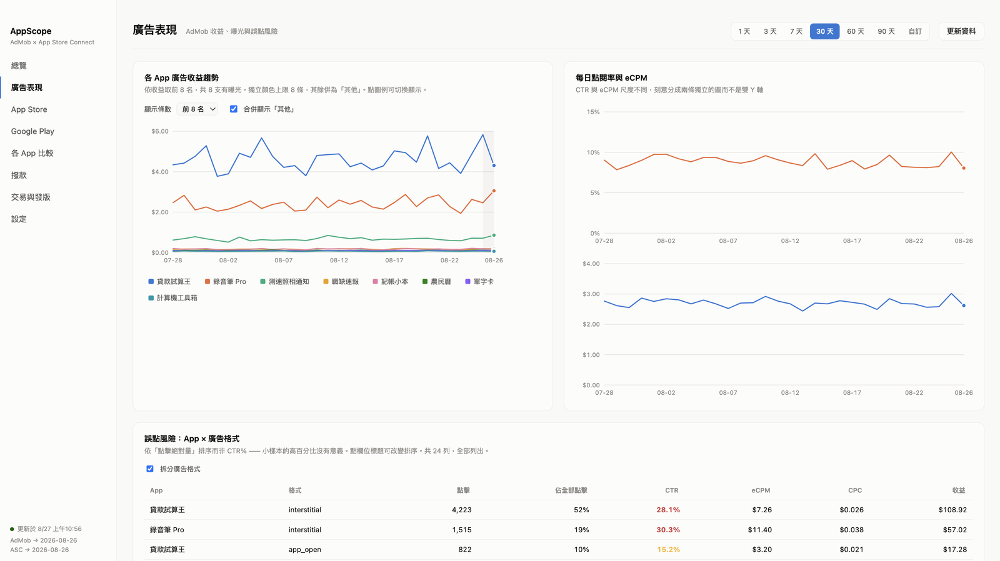
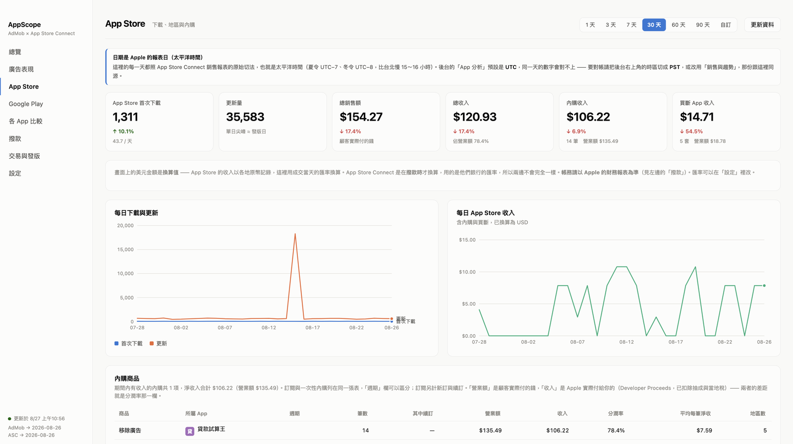
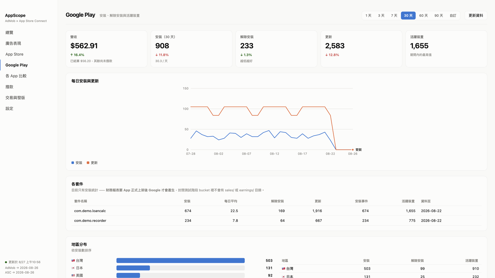
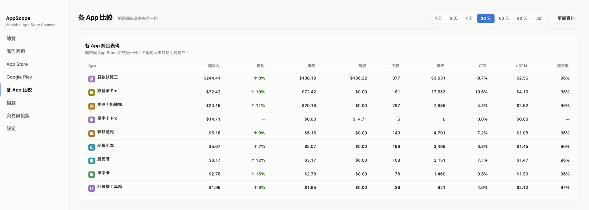
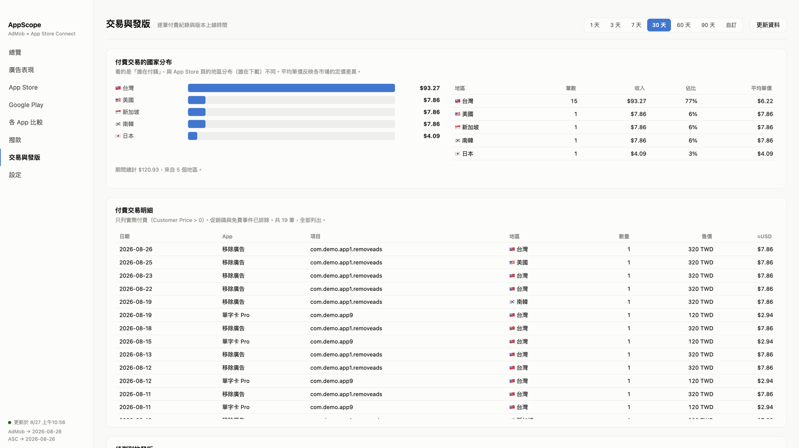

# AppScope

**把 AdMob、App Store Connect、Google Play 的數據放在同一個畫面。你的營運資料只存在自己的電腦。**

[](https://github.com/Adam1313943/AppScope-Public/releases/latest)
[](https://github.com/Adam1313943/AppScope-Public/releases/latest)

---



*畫面中的數字全部是示範資料，不是任何人的真實營收。*

## 這是什麼

如果你同時在用 AdMob 變現、在 App Store 和 Google Play 上架，你大概每天要開三個後台，然後在腦中把數字兜起來。

AppScope 把這三個來源抓進本機的 SQLite，用一個桌面程式看完：

- **總覽** — 廣告 + 商店的合併收入、下載量、CTR、eCPM，附最新單日數據
- **廣告表現** — 各 App 收益趨勢、誤點風險（App × 廣告格式）、結算修正記錄
- **App Store** — 下載與更新、地區分布、內購與買斷、逐筆交易
- **Google Play** — 安裝、解除安裝、活躍裝置、地區分布、營收
- **各 App 比較** — 兩個來源併在同一列，欄位可排序
- **撥款** — Apple 實際匯給你的錢，依 Apple 的會計月

## 四個你在原本後台看不到的東西

**撥款對得起來** — Apple 的撥款用的**不是日曆月**。「2026 年 7 月」實際上是 **6 月 28 日到 8 月 1 日**（週日到週六，35 天）。拿 7/1–7/31 去對永遠差一截 —— 不是資料錯，是期間不同，而後台不會告訴你這件事。AppScope 直接用會計月對帳，每一列旁邊寫著實際期間。

> 開發機上實測：用會計月的區間去查，每一個幣別都跟撥款畫面分毫不差 ——
> AUD −7.72、CNY 32.33、HKD 40.80、JPY 6,182、PHP 151.03、TWD 2,213，合計 117.28 USD。



**結算修正記錄** — AdMob 最近 1~2 天的數字未結算會低報，事後往上修。AppScope 每次更新都會比對差異並留存，所以你分得出「數字變了」是資料修正還是真的有變化。

**發版日偵測** — App Store 的更新量會在發版當天出現尖峰。用它對照「某個修正到底哪天上線」，比翻 git log 或版本頁準確。

**誤點風險表** — 依點擊絕對量排序（不是 CTR%），而且拆到 `App × 廣告格式`。全格式混算時橫幅的低 CTR 會把插頁的高 CTR 稀釋掉，看起來就沒事了。



## 其他畫面

<table>
<tr>
<td width="50%"><a href="docs/screenshots/store.png"></a><br><b>App Store</b> — 下載與更新、地區分布、內購與買斷</td>
<td width="50%"><a href="docs/screenshots/play.png"></a><br><b>Google Play</b> — 安裝、解除安裝、活躍裝置、地區分布</td>
</tr>
<tr>
<td><a href="docs/screenshots/apps.png"></a><br><b>各 App 比較</b> — 兩個來源併在同一列，欄位皆可排序</td>
<td><a href="docs/screenshots/txn.png"></a><br><b>交易與發版</b> — 逐筆交易明細與發版日偵測</td>
</tr>
</table>

## 兩個對不上時先看這裡

**金額是換算值。** App Store 的收入以各地原幣記錄，畫面上的美元是用成交當天的匯率換的。App Store Connect 是在**撥款時**才換算，用他們銀行的匯率 —— 兩邊不會完全一樣，這是結構性的，不是誤差。帳務請以 Apple 的財務報表為準（「撥款」那一頁的原幣金額就是 Apple 給的原始數字）。匯率可在設定裡改。

**AdMob 與 App Store 的 App 是用名稱比對的。** 名稱兩邊常常不同 —— App 改過名，或你有兩支名字很像的 App —— 比對可能會**配到別支上**，而畫面上的數字看起來完全正常。設定 →「App 對照」可以自己接，重複指派會標紅排到最前面。

## 你的營運資料只存在你的電腦

不需要註冊、沒有帳號。收益、下載量、App 名稱與各平台的憑證都不會離開這台機器 ——
所有報表抓下來就進本機的 SQLite：

```
macOS    ~/Library/Application Support/AppScope/appscope.db
Windows  %APPDATA%\\AppScope\\appscope.db
```

標準 SQLite 檔，你可以用任何工具直接查詢。

程式的對外連線只有三處：

| 連線 | 內容 |
|---|---|
| 抓取報表 | 用**你自己的**憑證向 AdMob / App Store Connect / Google Play 取你自己的資料 |
| 序號驗證 | 序號、Email 與裝置識別碼，用於授權與 3 台裝置上限 |
| 匿名統計與錯誤回報 | 用來知道哪裡壞了、哪些功能有人用 |

第三項**不含 App 名稱、金額、下載量或任何帳號資訊**。需要規模感時送的是數量級
（例如「抓了 1k-10k 列」）而不是實際數字；錯誤訊息在送出前會過濾掉 Email、
檔案路徑、bucket 名稱、Publisher ID、Vendor Number 與序號。

## 系統需求

| 平台 | 需求 | 下載 | 簽章狀態 |
|---|---|---|---|
| **macOS** | 14 Sonoma 以上、Apple Silicon（M1/M2/M3/M4） | `.dmg` | 已簽章並經 Apple 公證，可直接開啟 |
| **Windows** | Windows 10 / 11（64 位元） | `Setup.exe` 或免安裝 `.zip` | ⚠️ 尚未加入代碼簽章憑證 |

> **Windows 首次執行會看到 SmartScreen 警告**
> 畫面會顯示「Windows 已保護您的電腦」。點「**其他資訊**」→「**仍要執行**」即可。
> 這是因為安裝檔尚未加入 Authenticode 簽章憑證，不是軟體有問題。加入憑證後就不會再出現。

## 安裝與設定

1. 從 [Releases](https://github.com/Adam1313943/AppScope-Public/releases/latest) 下載
   - macOS：`.dmg`，開啟後拖進「應用程式」
   - Windows：`AppScope Setup x.x.x.exe`，或用免安裝的 `.zip`
2. 開啟後到**設定**分別連接三個來源

各來源需要的東西：

| 來源 | 需要準備 | 大約時間 |
|---|---|---|
| **AdMob** | 自己的 Google Cloud OAuth 用戶端（App 內有五步驟教學） | 3 分鐘 |
| **App Store Connect** | API 金鑰 `.p8` + Issuer ID + Vendor Number | 2 分鐘 |
| **Google Play** | Google 帳號授權 + 報表 bucket 名稱 | 2 分鐘 |

> **為什麼要你自己建 Google OAuth 用戶端？**
> 這樣授權完全走你自己的 Google Cloud 專案，我們不持有、也看不到任何人的憑證。代價是授權時會出現一次「Google 尚未驗證這個應用程式」的提示——那是在說**你自己的專案**沒送審，展開「進階」繼續即可。

App 內每一步都有教學連結與「測試連線」，遇到錯誤會直接告訴你要去哪裡改（例如 Play 的權限必須設為「全域」，只授權到特定應用程式的話 API 會回 403）。

## 試用與購買

- **7 天完整試用**，功能不打折（macOS 與 Windows 相同）
- 試用結束後**已抓回來的資料仍可完整瀏覽**，但無法再更新報表
- Pro 一次買斷，支援 3 台裝置，可在設定中「停用授權」釋出名額換機

購買請至 [產品頁](https://www.momosoft.one/appscope/tw)。

## 自動更新

程式常駐系統列，預設每天更新一次。每次會重抓最近 45 天並覆蓋——因為 AdMob 會回頭修正最近幾天的數字，只抓新的一天會永遠停在低報值。

## 疑難排解

**Play 顯示 403** — 授權的帳號在 Play Console →「使用者和權限」中，「查看應用程式資訊」必須設為**全域**。只授權到「選取的應用程式」時，網頁下載得到報表但 API 讀不到。

**AdMob 授權每 7 天失效** — 你的 Google Cloud 專案同意畫面停在「測試中」。改成「正式版」即可，不需要送審。

**Windows 出現 SmartScreen 警告** — 見上方系統需求的說明，點「其他資訊 → 仍要執行」。

**撥款金額跟 App Store Connect 對不起來** — 幾乎都是期間不同：Apple 用會計月（週日到週六），不是日曆月。「撥款」那一頁每一列都寫著實際起訖。

**某支 App 的廣告收益看起來不對** — 名稱比對可能配錯了。到設定 →「App 對照」檢查，尤其是標紅的重複指派。

**數字跟 AdMob 後台對不上** — 最後 1~2 天未結算，兩邊都會低報。「廣告表現」頁最下方的結算修正記錄會列出被改過的值。

---

## 回報問題

有問題請開 [Issue](https://github.com/Adam1313943/AppScope-Public/issues)。這個 repo 只放發行版本，原始碼未公開。

© 2026 momosoft
